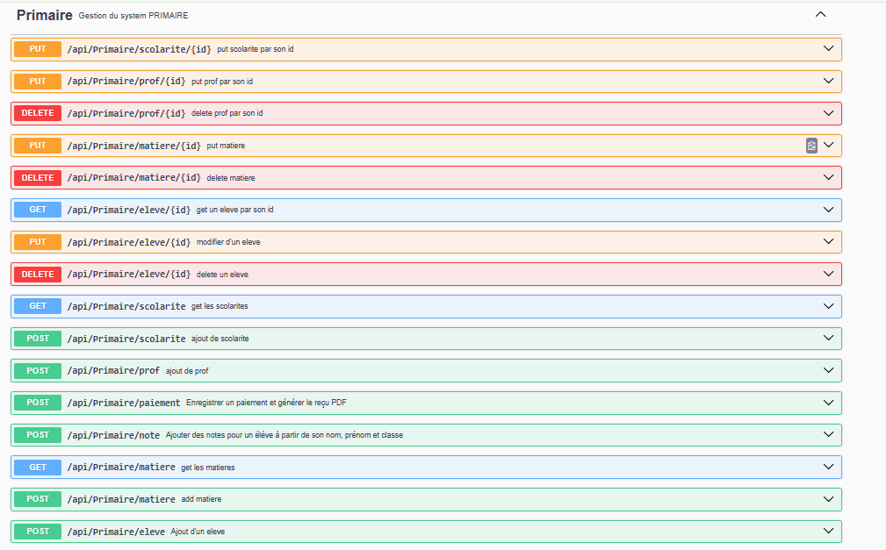

# 🎓 EdumapBack

Backend du projet **Edumap**, une application de gestion scolaire (inscriptions, paiements, notes, bulletins, etc.), développé avec **Spring Boot**.

---

## 🚀 Fonctionnalités principales
- Gestion des étudiants (inscription, classe…)
- Gestion des tuteurs
- Gestion des paiements (réductions, modalités, échéances…)
- Génération de reçus
- API REST prête à consommer par le frontend Angular

_---

## 📌 État du projet
👉 Actuellement, l’application couvre uniquement le **cycle primaire**.  
🚧 Le support pour le **collège** et le **lycée** est prévu dans les prochaines versions.

---

## 🛠️ Stack technique
- **Java 17+**
- **Spring Boot** (Web, Data JPA, Security…)
- **Hibernate / JPA**
- **MySQL** 
- **Maven** pour la gestion des dépendances

---

## ⚙️ Installation & démarrage

1. Cloner le projet :
   git clone https://github.com/bedjra/EdumapBack.git

    cd EdumapBack

2. Lancer le projet :
./mvnw spring-boot:run

3. L’API sera disponible à :
👉 http://localhost:8080

## 🤝 Contributeur

Bedjra Armel – Développeur backend

## 📄 Licence

Projet personnel réalisé pour démontrer son expertise en **Spring Boot**.

